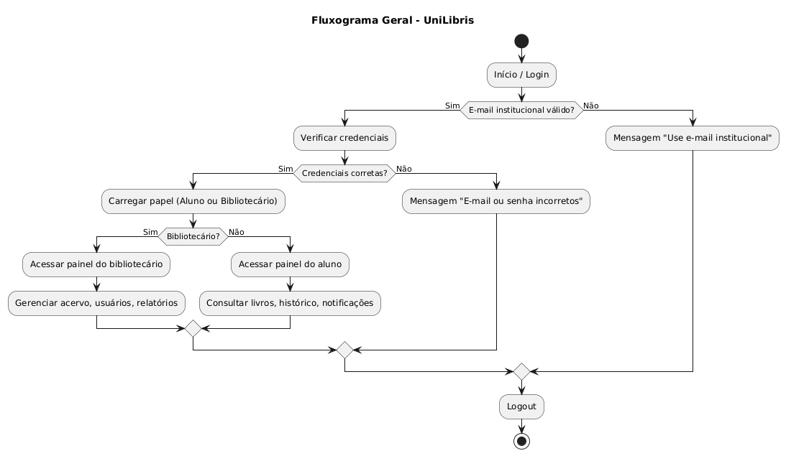
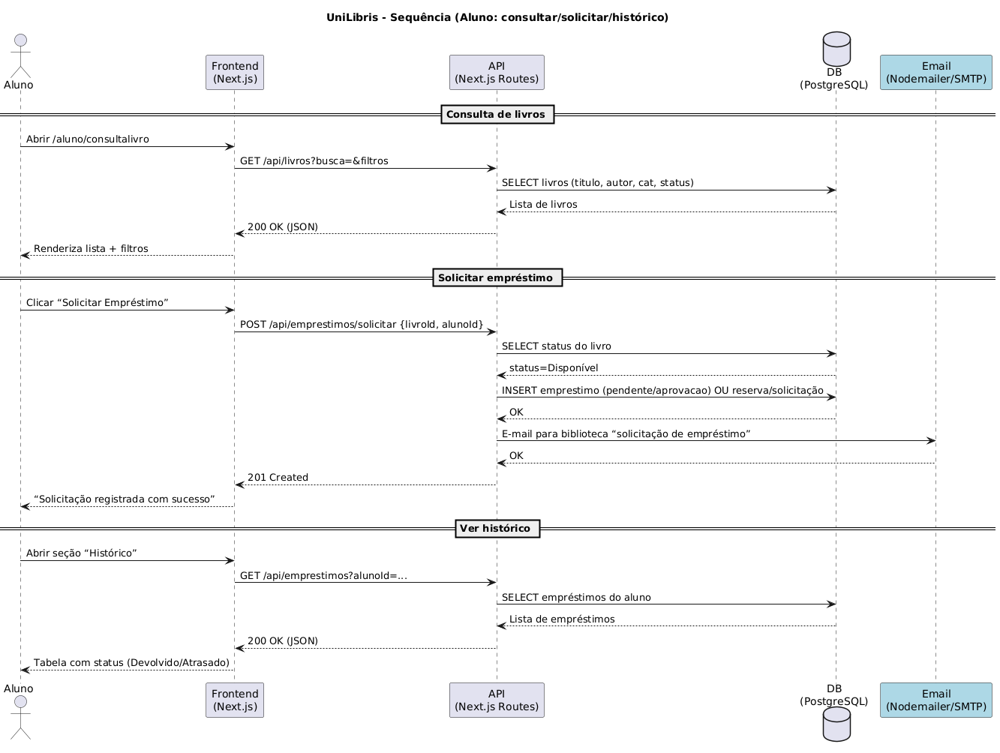
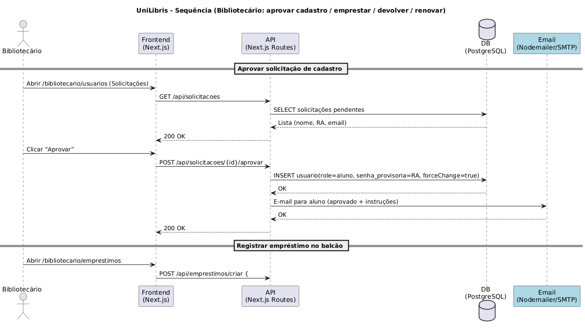
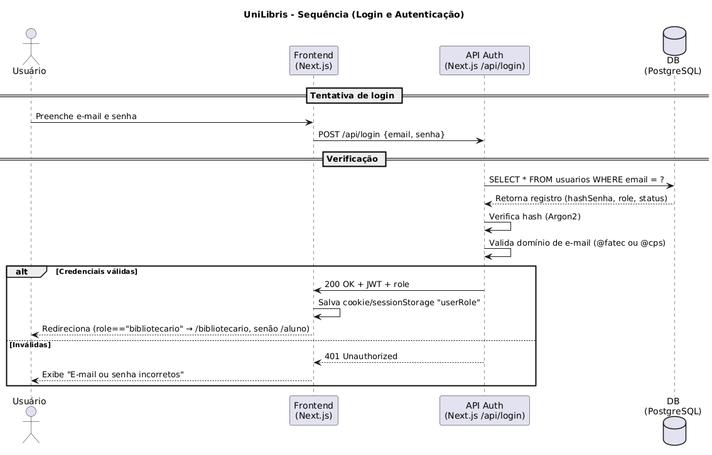

# UniLibris
UniLibris é um sistema de biblioteca universitária acessível tanto para bibliotecários quanto para alunos.  
Desenvolvido como site responsivo/PWA (Next.js no frontend, Node.js/Express no backend e PostgreSQL no banco de dados), oferece funcionalidades de cadastro e administração do acervo, controle de empréstimos/devoluções e consulta de disponibilidade de livros.  


## 📖 Origem do Nome

O nome **UniLibris** foi escolhido para refletir diretamente o propósito do sistema:

- **"Uni"** → abreviação de **Universidade**, representando o ambiente acadêmico para o qual o projeto é destinado.  
- **"Libris"** → deriva do **latim *liber***, que significa **livro**. O termo também aparece em expressões como *ex libris* (“dos livros de”), sempre relacionado ao conhecimento e à literatura.  

Assim, **UniLibris** pode ser interpretado como **“Livros da Universidade”** ou **“Biblioteca Universitária”**, transmitindo a ideia de um acervo acadêmico organizado e acessível para bibliotecários, professores e  alunos.  


### ✨ Valores transmitidos pelo nome
- **Simplicidade** → curto, fácil de pronunciar e memorizar.  
- **Identidade acadêmica** → conecta-se ao contexto universitário.  
- **Tradição + inovação** → combina uma raiz clássica (*libris*) com uma abordagem tecnológica moderna (site responsivo/PWA).

---

## 🚀 Tecnologias Utilizadas (planejadas)

### Frontend
- **Framework:** [Next.js](https://nextjs.org) (React)
- **Estilo:** [Tailwind CSS](https://tailwindcss.com)
- **Hospedagem:** [Vercel](https://vercel.com) (Free Tier)
- **Empacotamento:** Docker (imagem `ghcr.io/fpcxd/unilibris-frontend`)

### Backend
- **Ambiente:** Node.js + Express  
- **ORM / Schema:** Prisma  
- **Validação de dados:** Zod  
- **Hospedagem:** [Railway](https://railway.app) (Free) ou [Render](https://render.com) (Free)
- **Empacotamento:** Docker (imagem `ghcr.io/fpcxd/unilibris-backend`)
- **Automação de builds:** GitHub Actions + GitHub Container Registry (GHCR)

### Banco de Dados
- **Sistema:** PostgreSQL  
- **Serviços Gerenciados:** [Neon](https://neon.tech) ou [Supabase](https://supabase.com) (Free Tier)
- **Persistência:** Volume Docker (`/var/lib/postgresql/data`)

### Autenticação e Segurança
- **JWT** com senhas hasheadas via **Argon2id (Argon2)**  
- **OAuth (planejado)** via **Microsoft Entra ID (SSO)**  
  - Restringido a e-mails institucionais:  
    - `@fatec.sp.gov.br`  
    - `@cps.sp.gov.br`

### Comunicação e E-mails
- **Envio de e-mails transacionais:**  
  - [SendGrid](https://sendgrid.com) (Free Tier)  
  - ou **SMTP institucional (Microsoft 365)**  
- **Notificações internas:** via painel administrativo (novas versões, solicitações, avisos)

### Observabilidade e Logs
- **Monitoramento de erros e performance:** [Sentry](https://sentry.io)
- **Registro de atividades:** logs estruturados via Winston / console JSON (backend)
- **Acompanhamento de versão:** leitura de *releases* GitHub via API pública

---

## ⚙️ Resumo da Arquitetura e Atualizações

O **UniLibris** roda **100% dentro de contêineres Docker** — com **frontend**, **backend** e **banco de dados** isolados em serviços independentes, garantindo facilidade de deploy e portabilidade entre ambientes.

O servidor possui um arquivo fixo `docker-compose.yml`, responsável por orquestrar os serviços.  
Cada atualização do sistema é publicada através do **GitHub Releases**, e o **GitHub Actions** realiza automaticamente a **construção e publicação das imagens Docker** no **GitHub Container Registry (GHCR)**.

---

### 🧩 Fluxo de Atualização

1. Um novo **release** é criado no GitHub (exemplo: `v1.2.0`).
2. O **GitHub Actions**:
   - Builda as novas imagens (`frontend`, `backend`) via Docker;
   - Publica no **GHCR** (`ghcr.io/fpcxd/unilibris-frontend` e `unilibris-backend`);
   - Atualiza as tags `latest` e `v1.2.0`.
3. O **servidor não atualiza automaticamente** — o processo é controlado manualmente pelo bibliotecário no painel administrativo.
4. O sistema registra no banco de dados (ou em um arquivo JSON) as informações da **nova versão disponível** e suas **notas de atualização** (extraídas automaticamente do *release* no GitHub).
5. No painel do **bibliotecário**, aparece uma notificação:

   > 🔔 **Nova versão disponível:** 1.2.0  
   > 📝 *Correções:* melhorias na exportação de relatórios e na responsividade do painel.  
   > [🔄 **Atualizar Agora**]

6. Quando o bibliotecário confirma a atualização, o backend executa com segurança:

   ```bash
   docker compose pull && docker compose up -d

---

## 📂 Estrutura de Pastas

O projeto está organizado da seguinte forma:

```plaintext
unilibris/
│
├── backend/                             # API em Node.js/Express + integração com banco PostgreSQL
│   └── README.md
│
├── frontend/                            # Aplicação Next.js (interface do aluno e do bibliotecário)
│   └── README.md
│
├── docs/                                # Documentação completa do projeto
│   ├── README.md           
│   ├── prototipos/                      # Pasta para protótipos de UI/UX (wireframes e mockups).
|   |   ├── wireframe-aluno.md           # Dashboard do aluno
|   |   ├── wireframe-bibliotecario.md   # Dashboard do bibliotecário
|   |   ├── img_desktop/                 # Dashboards visuais (desktop)
|   |   │   ├── dashboard_aluno_.png
|   |   │   ├── perfil_aluno.png
|   |   │   ├── forgot-password.png
|   |   │   ├── login.png
|   |   │   ├── acervo.png
|   |   │   ├── emprestimos.png
|   |   │   ├── relatorios_.png
|   |   │   ├── usuarios-.png
|   |   │   ├── dashboard_bibliotecario.png
|   |   │   ├── notificacoes.png
|   |   │   ├── logout.png
|   |   │   └── register-.png
|   |   ├── img_mobile/                  # Dashboards visuais (mobile)
|   |   │   ├── dashboard_aluno-.jpg
|   |   │   ├── perfil_aluno.jpg
|   |   │   ├── forgot-password.jpg
|   |   │   ├── login.jpg
|   |   │   ├── acervo.jpg
|   |   │   ├── emprestimos.jpg
|   |   │   ├── relatorios_.jpg
|   |   │   ├── usuarios-.jpg
|   |   │   ├── dashboard_bibliotecario_.jpg
|   |   │   ├── notificacoes.jpg
|   |   │   ├── logout.jpg
|   |   │   └── register-.jpg
|   │   ├── Relatorio_Visita_Biblioteca_Fatec_A.pdf
|   |   └── README.md
│   ├── requirements/
|   |   └── non-functional.md            # Requisitos Não Funcionais 
|   └── uml/                             # Pasta para diagramas UML
|       ├── fluxograma-.png               # Fluxograma geral do sistema, mostrando o fluxo de uso entre alunos e bibliotecários
|       ├── casos_de_uso_.png             # Diagrama de casos de uso UML, ilustrando os atores e funcionalidades principais
|       ├── sequencia-aluno.png          # Diagrama de sequência UML mostrando a interação de um aluno consultando livros
|       ├── sequencia-bibliotecario.png  # Diagrama de sequência UML mostrando a interação de um bibliotecário cadastrando livros
|       └── sequencia-login.png          # Diagrama de sequência UML mostrando a interação de login com validação de role    
|
└── README.md                            # Apresentação geral do projeto
```

---

## Relatório de constatações obtidas após a visita à biblioteca da FATEC
[Relatório](docs/Relatorio_Visita_Biblioteca_Fatec_A.pdf)

---

## 🗂️ Funcionalidades Principais
- [ ] Cadastro e administração do acervo de livros  
- [ ] Controle de empréstimos e devoluções  
- [ ] Consulta de disponibilidade de livros pelos alunos  
- [ ] Área do bibliotecário com dashboards de gestão  
- [ ] Área do aluno com histórico de empréstimos  
- [ ] Notificações (atrasos/devoluções)

---

## 🧪 História de usuário e Gherkin
Este projeto adota **Behavior Driven Development (BDD)**.
As histórias de usuário e os cenários estão descritos em https://github.com/users/FPCxD/projects/1.

---

## 📐 Requisitos Não Funcionais
Os requisitos não funcionais estão descritos em [Requisitos Não Funcionais](docs/requirements/non-functional.md)

---

## 📝 Wireframes
### Wireframes (dashboard aluno e dashboard bibliotecário)

- **Dashboard Aluno**
O wireframe está disponível em [Dashboard Aluno - wireframe](docs/prototipos/wireframe-aluno.md)

- **Dashboard Bibliotecário**
O wireframe está disponível em [Dashboard Bibliotecário - wireframe](docs/prototipos/wireframe-bibliotecario.md)
  
---

## 🎨 Protótipos
### Diagramas UML (casos de uso, fluxograma e sequência)

- **Casos de uso**  
<p align="center">
  
</p>

- **Fluxograma**  
<p align="center">
  
</p>

- **Diagrama de sequência (Aluno)**  
<p align="center">
  
</p>

- **Diagrama de sequência (Bibliotecário)**  
<p align="center">
  
</p>

- **Diagrama de sequência (Login)**  
<p align="center">
  
</p>

  
### Protótipo de interface (UI/UX)
#### 🖥️ Dashboards – Desktop

- **Dashboard (aluno)**
<p align="center">
  
</p>

- **Perfil (aluno)**
<p align="center">
  
</p>

- **Dashboard (bibliotecário)**
<p align="center">  
  
</p>

- **Acervo (bibliotecário)**
<p align="center"> 
  
</p>

- **Empréstimos (bibliotecário)**
<p align="center"> 
  
</p>

- **Relatórios (bibliotecário)**
<p align="center"> 
  
</p>

- **Usuários (bibliotecário)**
<p align="center"> 
  
</p>

- **Notificações (bibliotecário)**
<p align="center"> 
  
</p>

---

#### 🔑 Telas de Acesso – Desktop

- **Login**
<p align="center"> 
  
</p>

- **Recuperar senha**
<p align="center"> 
  
</p>

- **Cadastro**
<p align="center">
  
</p>

- **Logout**
<p align="center">
  
</p>

---

#### 📱 Dashboards – Mobile

- **Dashboard (aluno)**
<p align="center">
  
</p>

- **Perfil (aluno)**
<p align="center">
  
</p>

- **Dashboard (bibliotecário)**
<p align="center">  
  
</p>

- **Acervo (bibliotecário)**
<p align="center"> 
  
</p>

- **Empréstimos (bibliotecário)**
<p align="center"> 
  
</p>

- **Relatórios (bibliotecário)**
<p align="center"> 
  
</p>

- **Usuários (bibliotecário)**
<p align="center"> 
  
</p>

- **Notificações (bibliotecário)**
<p align="center"> 
  
</p>

---

#### 🔑 Telas de Acesso – Mobile

- **Login**
<p align="center">
  
</p>

- **Recuperar senha**
<p align="center"> 
  
</p>

- **Cadastro**
<p align="center">
  
</p>

- **Logout**
<p align="center">
  
</p>

---

## 📌 Status do Projeto

🚧 Em desenvolvimento — em fase de prototipagem.
