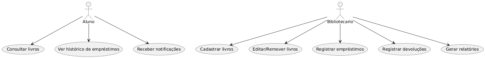
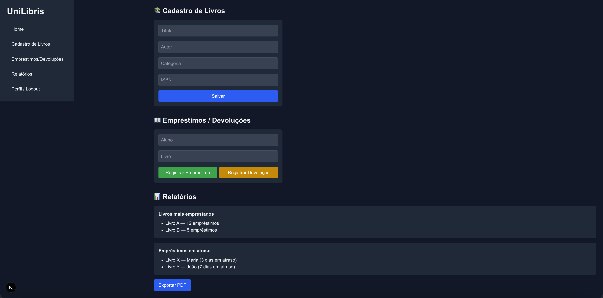

# UniLibris
UniLibris é um sistema de biblioteca universitária acessível tanto para bibliotecários quanto para alunos.  
Desenvolvido como site responsivo/PWA (Next.js no frontend, Node.js/Express no backend e PostgreSQL no banco de dados),  
oferece funcionalidades de cadastro e administração do acervo, controle de empréstimos/devoluções e consulta de disponibilidade de livros.  


## 📖 Origem do Nome

O nome **UniLibris** foi escolhido para refletir diretamente o propósito do sistema:

- **"Uni"** → abreviação de **Universidade**, representando o ambiente acadêmico para o qual o projeto é destinado.  
- **"Libris"** → deriva do **latim *liber***, que significa **livro**. O termo também aparece em expressões como *ex libris* (“dos livros de”), sempre relacionado ao conhecimento e à literatura.  

Assim, **UniLibris** pode ser interpretado como **“Livros da Universidade”** ou **“Biblioteca Universitária”**, transmitindo a ideia de um acervo acadêmico organizado e acessível tanto para bibliotecários, professores quanto para alunos.  


### ✨ Valores transmitidos pelo nome
- **Simplicidade** → curto, fácil de pronunciar e memorizar.  
- **Identidade acadêmica** → conecta-se ao contexto universitário.  
- **Tradição + inovação** → combina uma raiz clássica (*libris*) com uma abordagem tecnológica moderna (site responsivo/PWA).

---

## 🚀 Tecnologias Utilizadas (planejadas)
- **Frontend**: [Next.js](https://nextjs.org/) (React Framework)  
- **Backend**: [Node.js](https://nodejs.org/) + [Express](https://expressjs.com/)  
- **Banco de Dados**: [PostgreSQL](https://www.postgresql.org/)  
- **Estilização**: Tailwind CSS  
- **Autenticação**: JWT/OAuth
- **Hospedagem**: (a definir)

---

## 📂 Estrutura de Pastas

O projeto está organizado da seguinte forma:

```plaintext
unilibris/
│
├── backend/                             # API em Node.js/Express + integração com banco PostgreSQL
│   └── README.md
│
├── frontend/                            # Aplicação Next.js (interface do aluno e do bibliotecário)
│   └── README.md
│
├── docs/                                # Documentação completa do projeto
│   ├── README.md           
│   ├── prototipos/                      # Pasta para protótipos de UI/UX (wireframes e mockups).
|   |   ├── wireframe-aluno.md           # Dashboard do aluno
|   |   ├── wireframe-bibliotecario.md   # Dashboard do bibliotecário
|   |   ├── img_desktop/                 # Dashboards visuais (desktop)
|   |   │   ├── aluno.png
|   |   │   ├── bibliotecario.png
|   |   │   ├── forgot-password.png
|   |   │   ├── login.png
|   |   │   └── register.png
|   |   ├── img_mobile/                  # Dashboards visuais (mobile)
|   |   │   ├── aluno.png
|   |   │   ├── bibliotecario.png
|   |   │   ├── forgot-password.png
|   |   │   ├── login.png
|   |   │   └── register.png
|   |   └── README.md
│   ├── requirements/
|   |   └── non-functional.md            # Requisitos Não Funcionais 
|   └── uml/                             # Pasta para diagramas UML
|       ├── fluxograma.png               # Fluxograma geral do sistema, mostrando o fluxo de uso entre alunos e bibliotecários
|       ├── casos_de_uso.png             # Diagrama de casos de uso UML, ilustrando os atores e funcionalidades principais
|       ├── sequencia_aluno.png          # Diagrama de sequência UML mostrando a interação de um aluno consultando livros
|       ├── sequencia_bibliotecario.png  # Diagrama de sequência UML mostrando a interação de um bibliotecário cadastrando livros
|       └── sequencia_login.png          # Diagrama de sequência UML mostrando a interação de login com validação de role    
|
└── README.md                            # Apresentação geral do projeto
```

---

## 🗂️ Funcionalidades Principais (planejadas)
- [ ] Cadastro e administração do acervo de livros  
- [ ] Controle de empréstimos e devoluções  
- [ ] Consulta de disponibilidade de livros pelos alunos  
- [ ] Área do bibliotecário com dashboards de gestão  
- [ ] Área do aluno com histórico de empréstimos  
- [ ] Notificações (atrasos/devoluções)

---

## 🧪 História de usuário e Gherkin
Este projeto adota **Behavior Driven Development (BDD)**.
As histórias de usuário e os cenários estão descritos em https://github.com/users/FPCxD/projects/1.

---

## 📐 Requisitos Não Funcionais
Os requisitos não funcionais estão descritos em [Requisitos Não Funcionais](docs/requirements/non-functional.md)

---

## 🎨 Protótipos
### Diagramas UML (casos de uso, fluxograma e sequência)

- Casos de uso  


- Fluxograma  


- Diagrama de sequência (Aluno)  


- Diagrama de sequência (Bibliotecário)  


- Diagrama de sequência (Login)  


  
### Protótipo de interface (UI/UX)
#### 🖥️ Dashboards – Desktop

- **Aluno**  
  

- **Bibliotecário**  
  

---

#### 🔑 Telas de Acesso – Desktop

- **Login**  
  

- **Recuperar senha**  
  

- **Cadastro**  
  

---

#### 📱 Dashboards – Mobile

- **Aluno**  
  

- **Bibliotecário**  
  

---

#### 🔑 Telas de Acesso – Mobile

- **Login**  
  

- **Recuperar senha**  
  

- **Cadastro**  
  

---

## 📌 Status do Projeto

🚧 Em desenvolvimento — em fase de prototipagem.
