> UniLibris - Sistema de Gerenciamento de Biblioteca Universitária

[](https://github.com/FPCxD/UniLibris/actions)


### 📌 Status do Projeto
🚧 Em desenvolvimento — prototipagem

---

## 📑 Sumário

1.  [Sobre o Projeto](#-sobre-o-projeto)
2.  [Origem do Nome](#-origem-do-nome)
3.  [Objetivos e Público-Alvo](#-objetivos-e-público-alvo)
4.  [Funcionalidades Principais](#-funcionalidades-principais)
5.  [Relatório de Constatações](#-relatório-de-constatações-obtidas-após-a-visita-à-biblioteca-da-fatec)
6.  [Metodologia de Catalogação](#-metodologia-de-catalogação)
7.  [Tecnologias Utilizadas (planejadas)](#-tecnologias-utilizadas-planejadas)
8.  [Resumo da Arquitetura e Atualizações](#-resumo-da-arquitetura-e-atualizações)
9.  [Estrutura de Pastas](#-estrutura-de-pastas)
10. [História de Usuário e Gherkin](#-história-de-usuário-e-gherkin)
11. [Requisitos Não Funcionais](#-requisitos-não-funcionais)
12. [Wireframes](#-wireframes)
13. [Diagramas UML](#diagramas-uml)
14. [Protótipo de Interface](#protótipo-de-interface)
15. [Autores e Licença](#-autores-e-licença)


---

# 🧭 Sobre o Projeto
O **UniLibris** é um sistema web voltado para **gestão de bibliotecas acadêmicas**, desenvolvido como projeto do curso **Análise e Desenvolvimento de Sistemas da FATEC Araraquara**.
O sistema permite que **bibliotecários** e **alunos** interajam de forma integrada, abrangendo as rotinas de empréstimos, devoluções, reservas, notificações e relatórios.

---

## 📖 Origem do Nome

O nome **UniLibris** une dois conceitos:  
- **“Uni”**, de *Universidade*, representando o ambiente acadêmico;  
- **“Libris”**, do latim *liber* (“livro”), remetendo ao conhecimento e à literatura.  

Assim, **UniLibris** significa *“Livros da Universidade”* — simbolizando uma biblioteca digital acadêmica, acessível e organizada.

### ✨ Valores

- **Simplicidade:** curto e fácil de lembrar.  
- **Identidade acadêmica:** reflete o contexto universitário.  
- **Tradição e inovação:** combina uma raiz clássica a uma aplicação moderna.

---

## 🎯 Objetivos e Público-Alvo

- **Automatizar** as rotinas de empréstimo e devolução de livros;
- **Simplificar** o acesso ao acervo para alunos da instituição;
- **Aprimorar** o controle administrativo da biblioteca;
- **Integrar** notificações e relatórios em um painel intuitivo.

**Público-Alvo:**  
- Alunos da **FATEC**  
- Bibliotecários e equipe administrativa

---

## 💡 Funcionalidades Principais

### 👩‍🎓 Aluno
- Consulta de livros disponíveis  
- Solicitação de empréstimos  
- Histórico e notificações automáticas  

### 👩‍💼 Bibliotecário
- Cadastro e manutenção do acervo  
- Controle de empréstimos e devoluções  
- Geração de relatórios e exportações (PDF/CSV)  
- Gerenciamento de usuários  
- Notificações sobre novas versões do sistema  

---

## 📋 Relatório de constatações obtidas após a visita à biblioteca da FATEC
[RELATÓRIO](docs/Relatorio_Visita_Biblioteca_Fatec_A.pdf)

---

## 📚 Metodologia de Catalogação
O UniLibris adota uma metodologia de catalogação baseada nos principais padrões internacionais utilizados em sistemas de bibliotecas acadêmicas, garantindo compatibilidade com plataformas como Biblivre, Koha, Pergamum e Sophia.
[METODOLOGIA APLICADA](docs/catalogacao-padroes.md)

---

## 🚀 Tecnologias Utilizadas (planejadas)

### 🎨 Frontend
- **Framework:** [Next.js](https://nextjs.org) (React)
- **Estilo:** [Tailwind CSS](https://tailwindcss.com)
- **Hospedagem:** [Vercel](https://vercel.com) (Free Tier)
- **Empacotamento:** Docker (imagem `ghcr.io/fpcxd/unilibris-frontend`)

### 🧩 Backend
- **Ambiente:** Node.js + Express  
- **ORM / Schema:** Prisma  
- **Validação de dados:** Zod  
- **Hospedagem:** [Railway](https://railway.app) (Free) ou [Render](https://render.com) (Free)
- **Empacotamento:** Docker (imagem `ghcr.io/fpcxd/unilibris-backend`)
- **Automação de builds:** GitHub Actions + GitHub Container Registry (GHCR)

### 💾 Banco de Dados
- **Sistema:** PostgreSQL  
- **Serviços Gerenciados:** [Neon](https://neon.tech) ou [Supabase](https://supabase.com) (Free Tier)
- **Recursos adicionais:** Full Text Search (FTS) + trigramas para busca avançada
- **Persistência:** Volume Docker (`/var/lib/postgresql/data`)

### 🔐 Autenticação e Segurança
- **Autenticação:**  
  - **JWT** com senhas hasheadas via **Argon2id (Argon2)** com **salt exclusivo por usuário**
  - **OAuth (planejado)** via **Microsoft Entra ID (SSO)**  
    - Restringido a e-mails institucionais:  
      - `@fatec.sp.gov.br`  
      - `@cps.sp.gov.br`
- **Validação:** **Zod** em todas as rotas e formulários  
- **Criptografia:** TLS obrigatória nas comunicações  
- **Monitoramento:** **Sentry** + logs estruturados com **Winston**  
- **Scans automáticos:** **Prowler** + **GitHub Dependabot**  
- **Permissões:** controle por função (*aluno / bibliotecário*)  

### ⚙️ Automação e Recursos Inteligentes
- **Lembretes automáticos:** baseados em regras heurísticas  
- **Catalogação MARC21:** parser e importação automatizada  
- **Relatórios programados:** geração periódica em CSV e PDF  
- **Busca aprimorada:** Full Text Search (FTS) + trigramas  
  - *(planejada extensão semântica futura)*  

### ✉️ Comunicação e E-mails
- **Envio de e-mails transacionais:**  
  - [SendGrid](https://sendgrid.com) *(Free Tier)*  
  - ou **SMTP institucional (Microsoft 365)**  

### 🧩 Observabilidade e DevOps
- **CI/CD:** **GitHub Actions** + **GHCR**  
- **Containerização:** **Docker Compose**  
- **Monitoramento:** **Sentry** *(erros e performance)*  
- **Deploy controlado:** atualização manual via painel do bibliotecário  

---

## ⚙️ Resumo da Arquitetura e Atualizações

O **UniLibris** roda **100% dentro de contêineres Docker** — com **frontend**, **backend** e **banco de dados** isolados em serviços independentes, garantindo facilidade de deploy e portabilidade entre ambientes.

O servidor possui um arquivo fixo `docker-compose.yml`, responsável por orquestrar os serviços.  
Cada atualização do sistema é publicada através do **GitHub Releases**, e o **GitHub Actions** realiza automaticamente a **construção e publicação das imagens Docker** no **GitHub Container Registry (GHCR)**.

### 🧩 Fluxo de Atualização

1. Um novo **release** é criado no GitHub (exemplo: `v1.2.0`).
2. O **GitHub Actions**:
   - Builda as novas imagens (`frontend`, `backend`) via Docker;
   - Publica no **GHCR** (`ghcr.io/fpcxd/unilibris-frontend` e `unilibris-backend`);
   - Atualiza as tags `latest` e `v1.2.0`.
3. O **servidor não atualiza automaticamente** — o processo é controlado manualmente pelo bibliotecário no painel administrativo.
4. O sistema registra no banco de dados (ou em um arquivo JSON) as informações da **nova versão disponível** e suas **notas de atualização** (extraídas automaticamente do *release* no GitHub).
5. No painel do **bibliotecário**, aparece uma notificação:

   > 🔔 **Nova versão disponível:** 1.2.0  
   > 📝 *Correções:* melhorias na exportação de relatórios e na responsividade do painel.  
   > [🔄 **Atualizar Agora**]

6. Quando o bibliotecário confirma a atualização, o backend executa com segurança:

   ```bash
   docker compose pull && docker compose up -d

---

## 📂 Estrutura de Pastas

O projeto está organizado da seguinte forma:

```plaintext
unilibris/
│
├── backend/                             # API em Node.js/Express + integração com banco PostgreSQL
│   └── README.md
│
├── frontend/                            # Aplicação Next.js (interface do aluno e do bibliotecário)
│   └── README.md
│
├── docs/                                # Documentação completa do projeto
│   ├── README.md           
│   ├── prototipos/                      # Pasta para protótipos de UI/UX (wireframes e mockups).
|   |   ├── wireframe-aluno.md           # Dashboard do aluno
|   |   ├── wireframe-bibliotecario.md   # Dashboard do bibliotecário
|   |   ├── img_desktop/                 # Dashboards visuais (desktop)
|   |   │   ├── dashboard_aluno_.png
|   |   │   ├── perfil_aluno.png
|   |   │   ├── forgot-password.png
|   |   │   ├── login.png
|   |   │   ├── acervo.png
|   |   │   ├── emprestimos.png
|   |   │   ├── relatorios_.png
|   |   │   ├── usuarios-.png
|   |   │   ├── dashboard_bibliotecario.png
|   |   │   ├── notificacoes.png
|   |   │   ├── logout.png
|   |   │   └── register-.png
|   |   ├── img_mobile/                  # Dashboards visuais (mobile)
|   |   │   ├── dashboard_aluno-.jpg
|   |   │   ├── perfil_aluno.jpg
|   |   │   ├── forgot-password.jpg
|   |   │   ├── login.jpg
|   |   │   ├── acervo.jpg
|   |   │   ├── emprestimos.jpg
|   |   │   ├── relatorios_.jpg
|   |   │   ├── usuarios-.jpg
|   |   │   ├── dashboard_bibliotecario_.jpg
|   |   │   ├── notificacoes.jpg
|   |   │   ├── logout.jpg
|   |   │   └── register-.jpg
|   │   ├── Relatorio_Visita_Biblioteca_Fatec_A.pdf
|   |   ├── catalogacao-padroes.md 
|   |   └── README.md
│   ├── requirements/
|   |   └── non-functional.md              # Requisitos Não Funcionais 
|   └── uml/                               # Pasta para diagramas UML
|       ├── fluxograma--.png               # Fluxograma geral do sistema, mostrando o fluxo de uso entre alunos e bibliotecários
|       ├── casos-de-uso.png               # Diagrama de casos de uso UML, ilustrando os atores e funcionalidades principais
|       ├── sequencia-aluno-.png           # Diagrama de sequência UML mostrando a interação de um aluno consultando livros
|       ├── sequencia-bibliotecario--.png  # Diagrama de sequência UML mostrando a interação de um bibliotecário cadastrando livros
|       └── sequencia-login-.png           # Diagrama de sequência UML mostrando a interação de login com validação de role    
|
└── README.md                              # Apresentação geral do projeto
```

---

## 🧪 História de usuário e Gherkin
Este projeto adota **Behavior Driven Development (BDD)**.
As histórias de usuário e os cenários estão descritos em https://github.com/users/FPCxD/projects/1.

---

## 📐 Requisitos Não Funcionais
Os requisitos não funcionais estão descritos em [Requisitos Não Funcionais](docs/requirements/non-functional.md)

---

## 📝 Wireframes
### Wireframes (dashboard aluno e dashboard bibliotecário)

- **Dashboard Aluno**
O wireframe está disponível em [Dashboard Aluno - wireframe](docs/prototipos/wireframe-aluno.md)

- **Dashboard Bibliotecário**
O wireframe está disponível em [Dashboard Bibliotecário - wireframe](docs/prototipos/wireframe-bibliotecario.md)
  
---

## Diagramas UML

- **Casos de uso**  
<p align="center">
  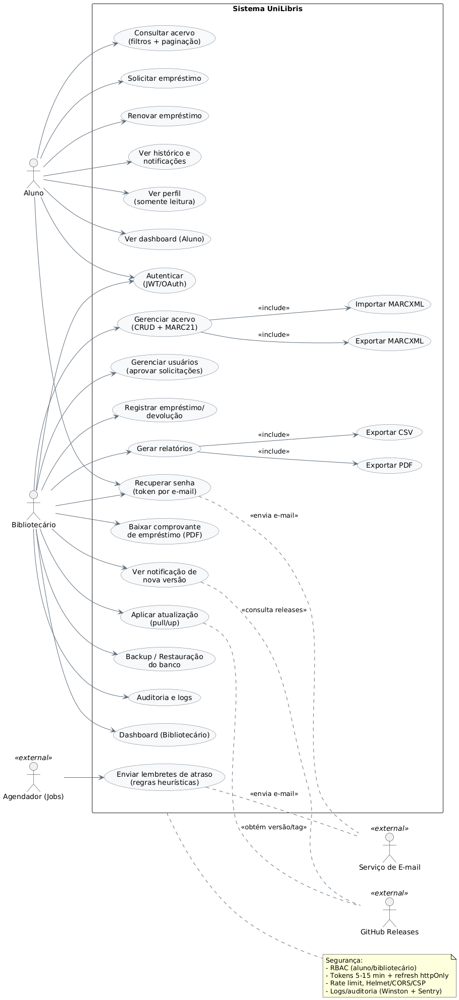
</p>

- **Fluxograma**  
<p align="center">
  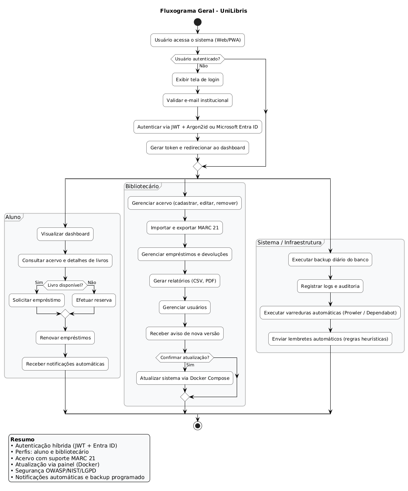
</p>

- **Diagrama de sequência - Aluno**  
<p align="center">
  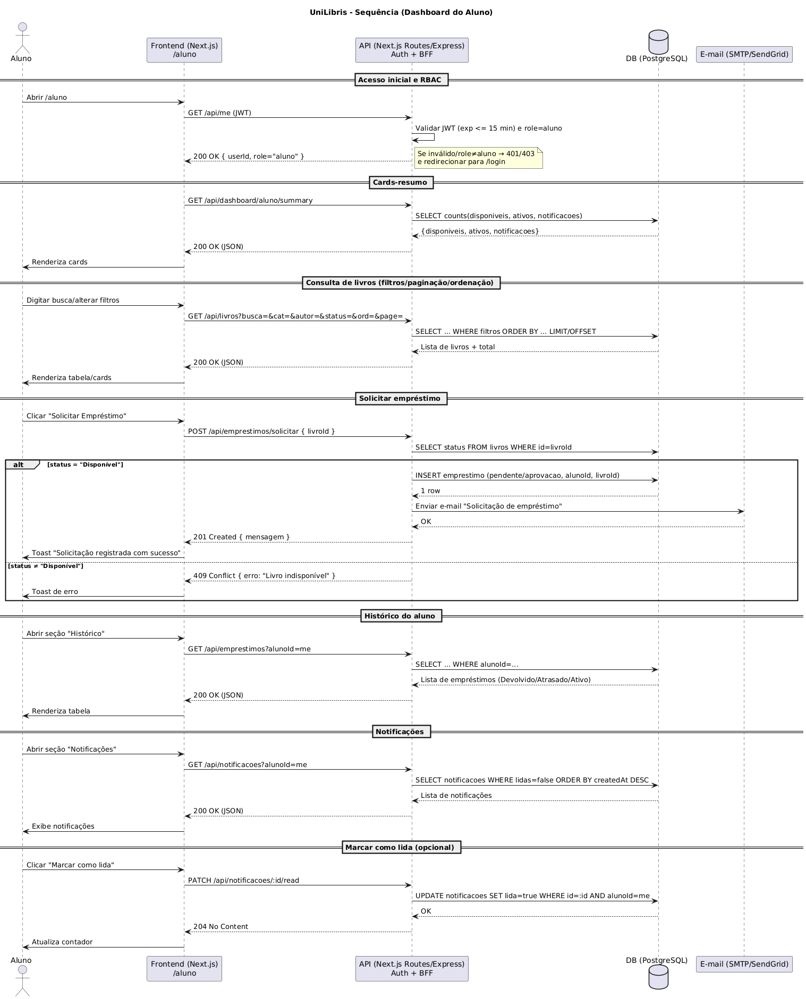
</p>

- **Diagrama de sequência - Bibliotecário**  
<p align="center">
  
</p>

- **Diagrama de sequência - Login**  
<p align="center">
  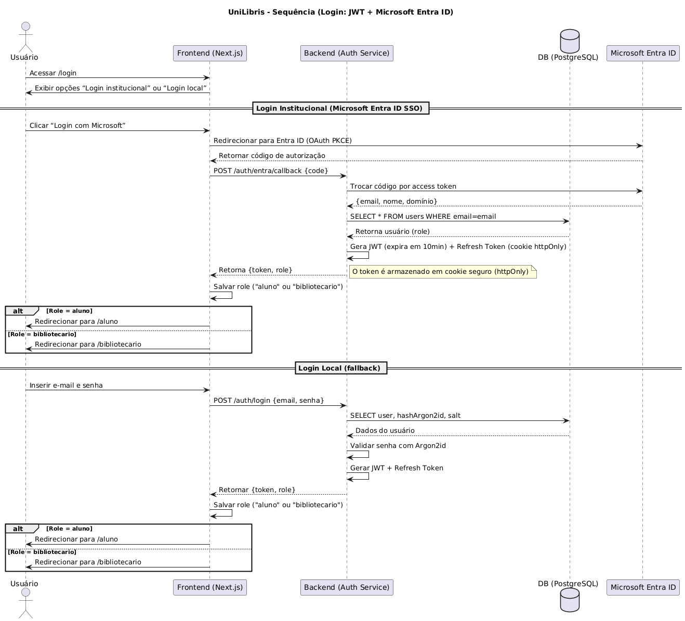
</p>

---

## Protótipo de Interface
#### 🖥️ Dashboards – Desktop

- **Dashboard (aluno)**
<p align="center">
  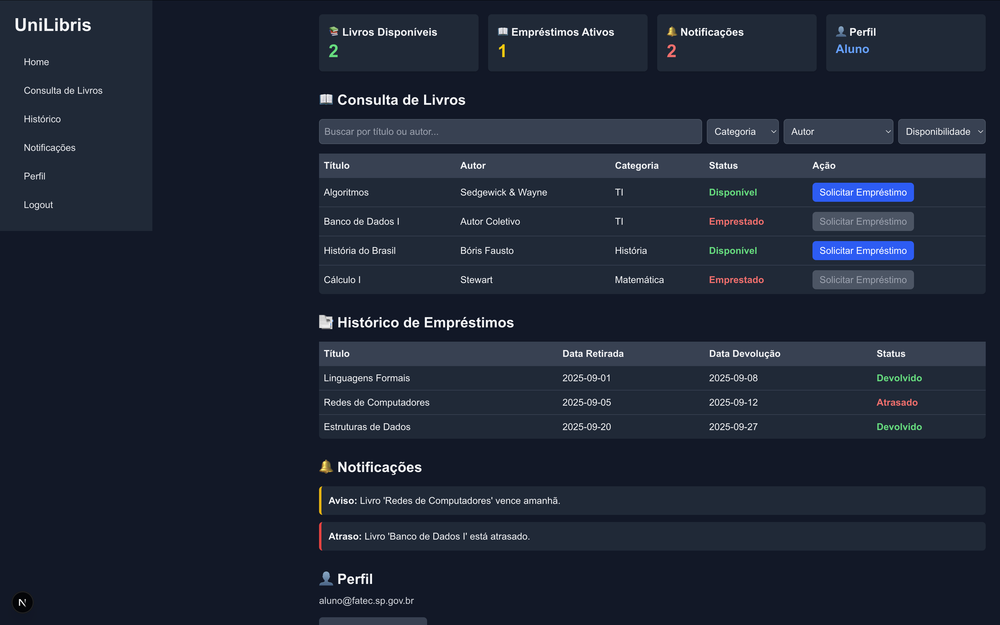
</p>

- **Perfil (aluno)**
<p align="center">
  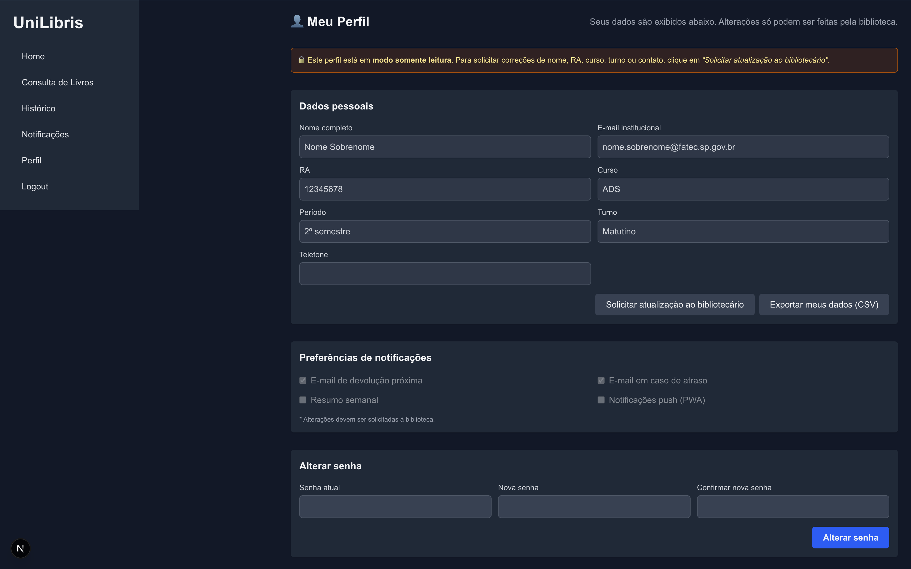
</p>

- **Dashboard (bibliotecário)**
<p align="center">  
  
</p>

- **Acervo (bibliotecário)**
<p align="center"> 
  
</p>

- **Empréstimos (bibliotecário)**
<p align="center"> 
  
</p>

- **Relatórios (bibliotecário)**
<p align="center"> 
  
</p>

- **Usuários (bibliotecário)**
<p align="center"> 
  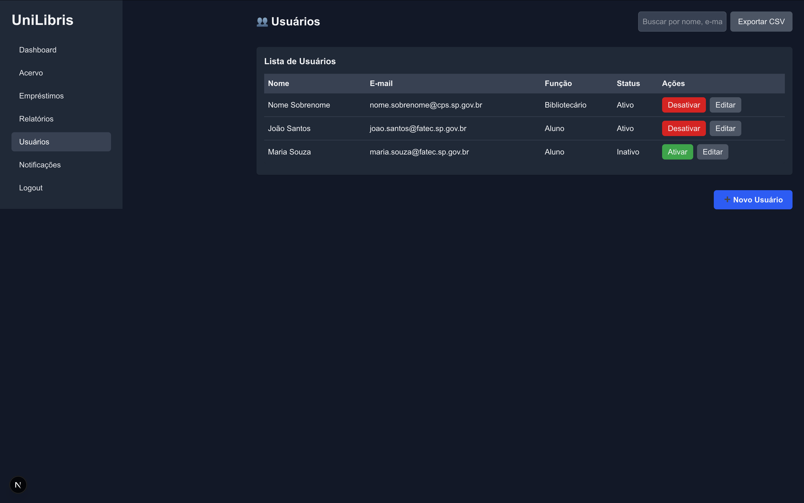
</p>

- **Notificações (bibliotecário)**
<p align="center"> 
  
</p>

---

#### 🔑 Telas de Acesso – Desktop

- **Login**
<p align="center"> 
  
</p>

- **Recuperar senha**
<p align="center"> 
  
</p>

- **Cadastro**
<p align="center">
  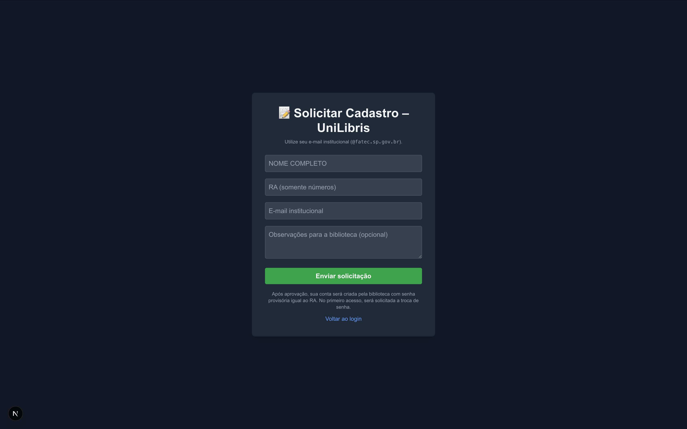
</p>

- **Logout**
<p align="center">
  
</p>

---

#### 📱 Dashboards – Mobile

- **Dashboard (aluno)**
<p align="center">
  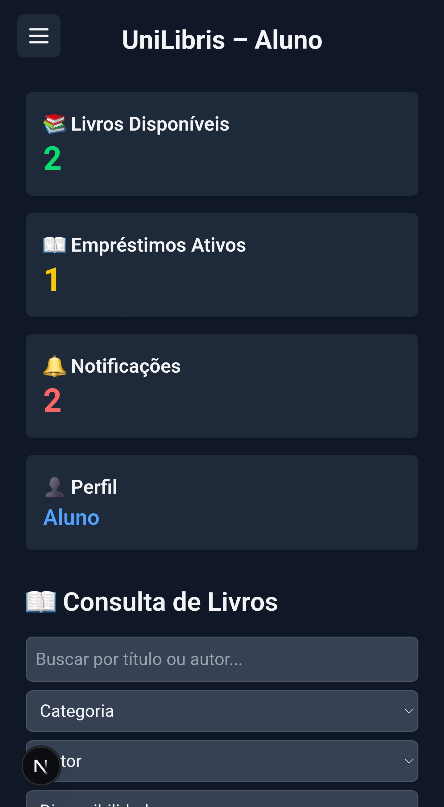
</p>

- **Perfil (aluno)**
<p align="center">
  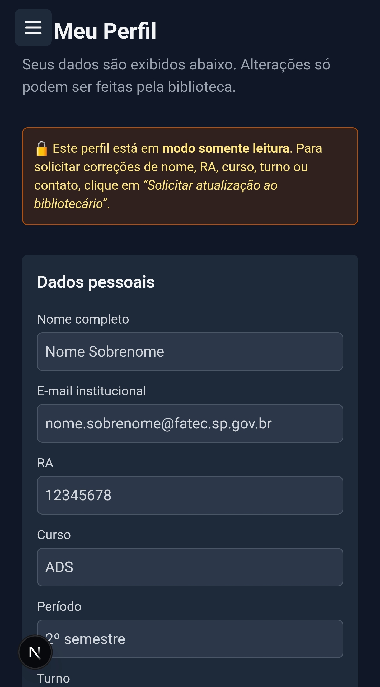
</p>

- **Dashboard (bibliotecário)**
<p align="center">  
  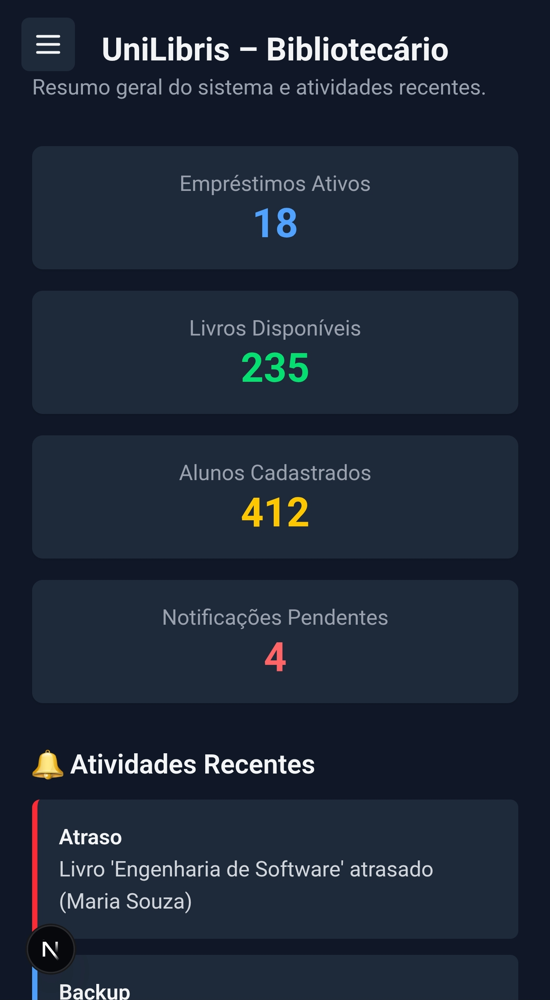
</p>

- **Acervo (bibliotecário)**
<p align="center"> 
  
</p>

- **Empréstimos (bibliotecário)**
<p align="center"> 
  
</p>

- **Relatórios (bibliotecário)**
<p align="center"> 
  
</p>

- **Usuários (bibliotecário)**
<p align="center"> 
  
</p>

- **Notificações (bibliotecário)**
<p align="center"> 
  
</p>

---

#### 🔑 Telas de Acesso – Mobile

- **Login**
<p align="center">
  
</p>

- **Recuperar senha**
<p align="center"> 
  
</p>

- **Cadastro**
<p align="center">
  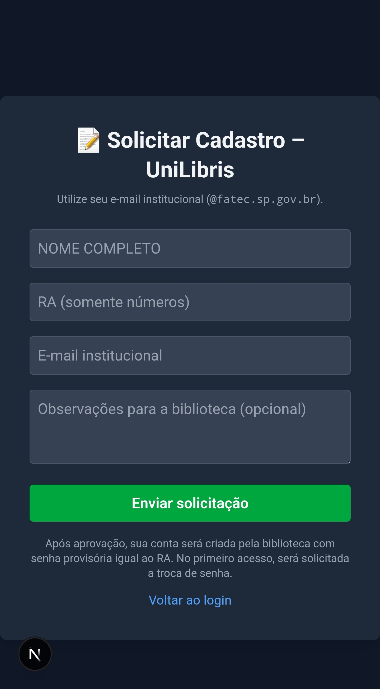
</p>

- **Logout**
<p align="center">
  
</p>

---

## 👥 Autores e Licença

**Desenvolvido por:**  
[**Fernando Parra Cano**](https://github.com/FPCxD) — FATEC Araraquara  
Curso de **Análise e Desenvolvimento de Sistemas**

🌐 **Mais sobre o autor:**  
[Linktree — FPC2903](https://linktr.ee/FPC2903)

📜 **Licença:**  
Este projeto é distribuído sob a **[MIT License](./LICENSE)**.  
Você é livre para usar, modificar e distribuir o código, desde que mantenha os créditos ao autor.


